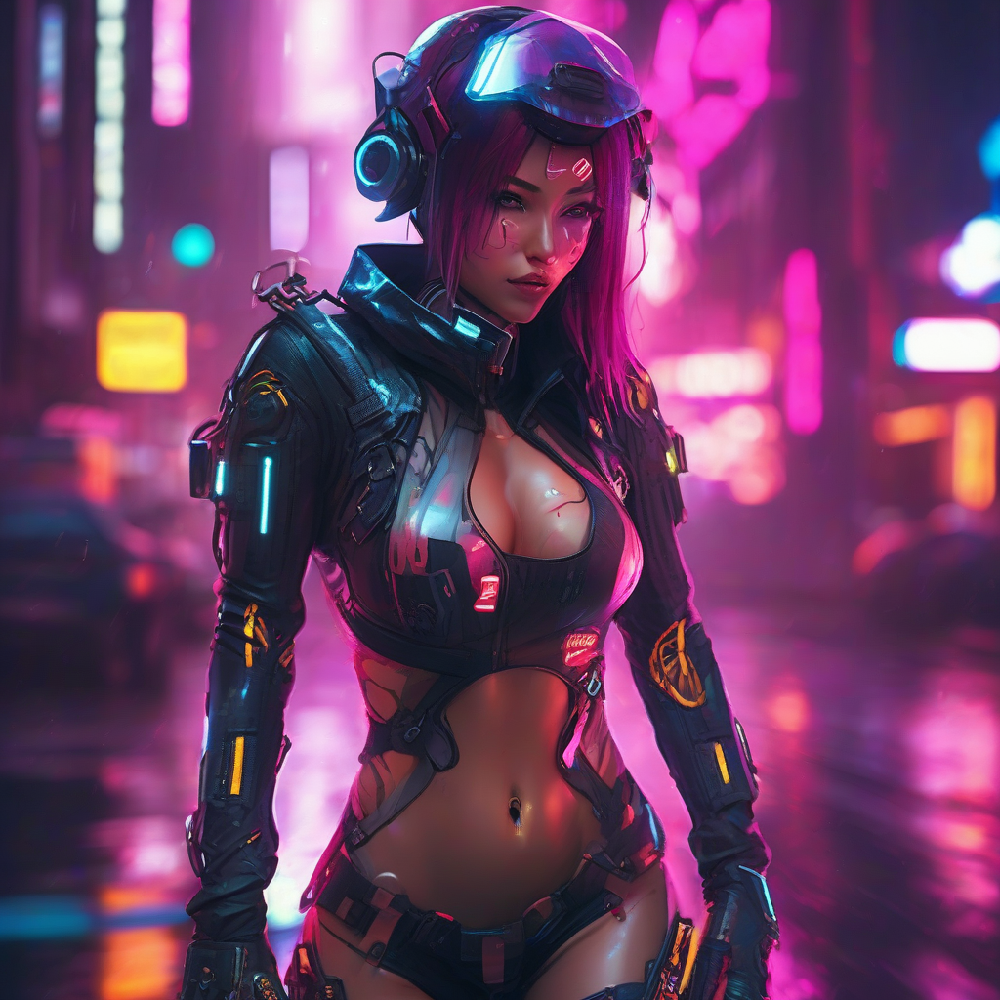
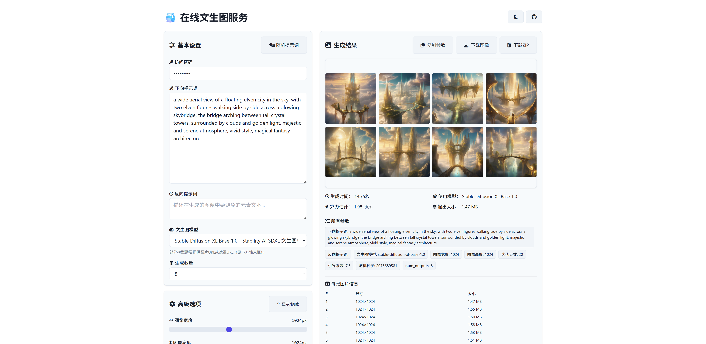

<p align="center">
  
</p>

<div align="center">
  <h1>Text2img · Cloudflare Workers</h1>
  <p>基于 Cloudflare Workers AI 的在线文生图/图生图/重绘服务，开箱即用。</p>
  <a href="[https://text2img.huarzone.com](https://shiny-king-b3b5.z1956444369.workers.dev/)/" target="_blank">在线体验(默认密码admin123)</a>
</div>

<picture>
  <source media="(prefers-color-scheme: dark)" srcset="public/top-dark.png">
  
</picture>

### 功能总览

- 多模型：SDXL、FLUX、DreamShaper、Lightning、SD1.5 图生图、SD1.5 局部重绘
- 一次生成 1–8 张，画廊预览 + 悬浮操作（放大/复制/单张下载）
- 批量下载 ZIP、复制参数、显示每张尺寸与大小
- 真实 it/s 指标（服务端推理耗时），带进度条与 60s 超时提示
- 登录认证（Cookie），支持密码保护、明暗主题、自适应移动端

---

## 一键部署

1) Cloudflare 控制台 → Workers & Pages → 创建 Worker → 部署。

2) 绑定 Workers AI：设置 → 绑定 → 添加绑定 → 类型选 “Workers AI”，变量名填 `AI` → 保存。

3) 复制代码：将 `src/worker.js` 与 `src/index.html` 内容分别放入同名文件，保存并部署。

4) 可选：设置自定义域（设置 → 域和路由）。

完成后访问 `https://<name>.<subdomain>.workers.dev/` 即可使用。

---

## 使用说明（前端）

- 基本：输入访问密码（若启用）→ 填写提示词 → 选择模型 → 配置尺寸/步数/引导/种子 → 选择“生成数量” → 生成。
- 画廊：多图时显示网格，悬浮显示操作条（放大/复制/下载）。支持 ZIP 批量下载。
- 指标：右栏显示生成时间、使用模型、it/s（步数/秒）、输出大小、所有参数；下方表格列出每张图片的尺寸与大小。
- 进度：进度条最多推进到 95%，图片真正完成后封顶 100%。

---

## 模型能力与适用场景

| 模型 ID | 类型 | 适合图片/场景 | 建议 | 备注 |
| --- | --- | --- | --- | --- |
| stable-diffusion-xl-base-1.0 | 文生图 | 通用写实/插画、高分辨率 1024×1024，人物/风景/产品图 | 步数 20 左右，宽高 1024 起步 | 质量稳定、细节好，速度中等 |
| flux-1-schnell | 文生图（快速） | 快速草图/封面/风格化作品，追求速度的场景 | 步数 4–8（已自动限制），较小分辨率起步 | 返回 JSON（base64）→ 已在后端转为 PNG 输出 |
| dreamshaper-8-lcm | 文生图（LCM） | 二次元/插画/艺术风格，迭代少、出图快 | 步数 8–12，512–768 更稳 | 风格统一、对细节追求适中 |
| stable-diffusion-xl-lightning | 文生图（极速） | 秒级出图、快速迭代与方案对比 | 极少步数（1–4），512–768 | 速度快、细节欠佳，适合草稿 |
| stable-diffusion-v1-5-img2img | 图生图 | 风格迁移、构图保持、低侵入式修改 | 需传 `image_url`，步数与 strength 控制变化幅度 | 输入图必须是图片直链（image/*）≤10MB |
| stable-diffusion-v1-5-inpainting | 局部重绘 | 遮罩内替换/修复/擦除/换物 | 需 `image_url` + `mask_url`，mask 黑白/透明区域为编辑区 | 遮罩与原图分辨率一致更稳 |

> 小贴士：遇到 3001/内部错误，优先降低尺寸到 512–768、减少步数，并确认 `image_url/mask_url` 为可访问的图片直链且不超过 10MB。

---

## 后端接口

- GET `/api/models`：返回可用模型清单（含 `requiresImage/Mask`）。
- GET `/api/prompts`：随机提示词。
- GET `/api/config`：是否启用密码。
- POST `/api/auth`：提交 `{ password }` 设置 Cookie 登录。
- POST `/`：生成图片
  - 入参（JSON）：
    - 通用：`prompt, negative_prompt, model, width, height, num_steps, guidance, seed, num_outputs(1-8)`
    - 图生图：另需 `image_url`
    - 重绘：另需 `image_url, mask_url`
  - 出参：
    - 单图：二进制 PNG，头部包含 `X-Used-Model / X-Server-Seconds / X-Image-Bytes`
    - 多图：`{ images: [dataURL...] }` JSON，头部含 `X-Server-Seconds`

示例（cURL）：

```bash
curl -X POST https://<worker>.<subdomain>.workers.dev/ \
  -H 'Content-Type: application/json' -H 'Accept: image/*' \
  -d '{
    "prompt":"a cyberpunk cat",
    "model":"stable-diffusion-xl-base-1.0",
    "width":1024,"height":1024,"num_steps":20,"guidance":7.5,
    "num_outputs":1
  }' --output out.png
```

---

## 配置与自定义

- 模型清单：编辑 `src/worker.js` 中 `AVAILABLE_MODELS` 可增删/改描述、是否需要图片/遮罩。
- 随机提示词：在 `RANDOM_PROMPTS` 维护。
- 密码：`PASSWORDS=['admin123']`（留空即无密码），前端含登录遮罩与 Cookie 认证。
- 生成数量：默认开放 1–8，可在前端下拉与后端上限同步调整。

---

## 常见问题

- 3001 Unknown internal error：通常为尺寸/步数过大或图片直链不规范。将宽高调到 512–768、步数 < 20；确保 `image_url`/`mask_url` 响应头为 `image/*` 且 ≤10MB。
- 3030 missing mask_image：使用 inpainting 时必须提供 `mask_url`（已在前端/后端分别做必填校验）。
- it/s 为什么波动：以服务端推理耗时为准（`X-Server-Seconds`），网络/解码不会影响该指标。

---

## 致谢

- [Cloudflare Workers](https://workers.cloudflare.com/)
- [Cloudflare AI](https://developers.cloudflare.com/workers-ai/)
